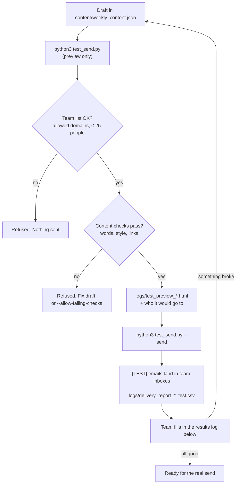

# Team test sends

Before an issue goes to real recipients, send the draft to your team and
check how it actually lands. `test_send.py` sends only to the people in
`test_recipients.json`. It never reads the hercules.works user pull or
the personnel CSV. It refuses to run if any address is outside
`TEST_ALLOWED_DOMAINS`, and it previews only unless you pass `--send`.



## One-time setup

Test sends go through **your own Gmail or Google Workspace account**
(`gmail_smtp`) -- free, no signup, no domain setup. It's a personal
mailbox sending on your behalf, not a real ESP, so it's for this test
phase only; the real send will move to a proper provider once the
hercules.works recipient API and personnel CSV are wired up (see
README).

1. **Turn on 2-Step Verification** on the Google account you'll send
   from, if it isn't already: [myaccount.google.com/security](https://myaccount.google.com/security).
   Gmail requires this before it will issue an app password -- it
   stopped accepting your regular account password for SMTP login in
   2025.
2. **Generate an app password**: [myaccount.google.com/apppasswords](https://myaccount.google.com/apppasswords)
   -> name it "Hercules newsletter test" -> Create. Copy the 16-character
   password it shows you (you won't be able to see it again).
3. `cp .env.example .env`, then set:
   - `ESP_PROVIDER=gmail_smtp`
   - `FROM_EMAIL=` the exact Gmail/Workspace address you generated the
     app password for (it doesn't need to be `newsletter@hercules.works`
     for testing -- any address you personally control works, and your
     team will see it as the sender)
   - `FROM_NAME=` whatever display name you want your team to see
   - `GMAIL_APP_PASSWORD=` the 16-character password from step 2 (no spaces)
   - `TEST_ALLOWED_DOMAINS`: e.g. `hercules.works,jupitermeta.io`
4. `cp sample_data/test_recipients.example.json test_recipients.json`
   and list your team. Set `segment` to `active` or `dormant` per person
   so you see both CTA variants ("Run your next study" and "See what's
   new since you left").
5. `pip install requests`

Sending limits are Google's: 500 recipients/day on a personal Gmail
account, 2,000/day on Workspace -- both far above what a team test
needs. If that ever isn't enough, `esp.py` also has a `brevo` option
(free, 300/day, no DNS setup, verifies a sender by an emailed link
instead of an app password) -- just change `ESP_PROVIDER`.

## Each test round

```bash
# 1. Preview: who it goes to, rendered HTML in logs/, all checks. Sends nothing.
python3 test_send.py

# 2. Send to the whole team list
python3 test_send.py --send

#    ...or just to yourself first
python3 test_send.py --send --only you@hercules.works

#    Use a separate test link so team clicks don't count toward the
#    real issue's UTM campaign
python3 test_send.py --send --cta-url "https://hercules.works/?utm_source=newsletter&utm_medium=email&utm_campaign=team-test"

#    Check layout on a draft that doesn't pass the content checks yet
python3 test_send.py --send --allow-failing-checks
```

Every run writes `logs/delivery_report_<time>_test[_dryrun].csv` (who,
and sent/failed) and `logs/last_test_summary.json`. Test sends put
"[TEST]" at the start of the subject and are never archived to
`content/sent/`.

## What to check

Have people open the email on as many of these as your team covers.
Mail clients render email very differently, and the desktop Outlook app
for Windows is the most restrictive.

| # | Check | What "works" looks like |
|---|---|---|
| 1 | **Arrival** | In the main inbox, not Spam. Note whether Gmail files it under Promotions. |
| 2 | **Sender and subject** | The sender reads "Hercules.works". The subject is the hook, not cut off badly on mobile. |
| 3 | **Hero illustration** | The stat ring with the number shows. If you see blank space or alt text instead, write down which app it was. |
| 4 | **Layout** | Nothing overflows or squashes on a phone. The checkmark bullets line up. |
| 5 | **Dark mode** | Text stays readable and the button is still visible. |
| 6 | **CTA button** | Looks like a button. Tapping it opens the right page, and the address bar still shows the `utm_` parameters. |
| 7 | **CTA label** | "active" people see "Run your next study". "dormant" people see "See what's new since you left". |
| 8 | **Unsubscribe link** | Currently a placeholder that opens the homepage. Expected to not actually unsubscribe. |
| 9 | **Read** | Takes about 2 minutes. The hook makes you want to keep reading. |

## Results log

Copy one row per person per app for each test round.

| Round | Tester | App + device | Inbox / Promotions / Spam | Hero shows | Layout OK | Dark mode OK | CTA opens with UTM | Notes |
|---|---|---|---|---|---|---|---|---|
| 1 | | Gmail, iPhone app | | | | | | |
| 1 | | Gmail, desktop web | | | | | | |
| 1 | | Apple Mail, iPhone | | | | | | |
| 1 | | Outlook desktop app, Windows | | | | | | |
| 1 | | Outlook on the web | | | | | | |
